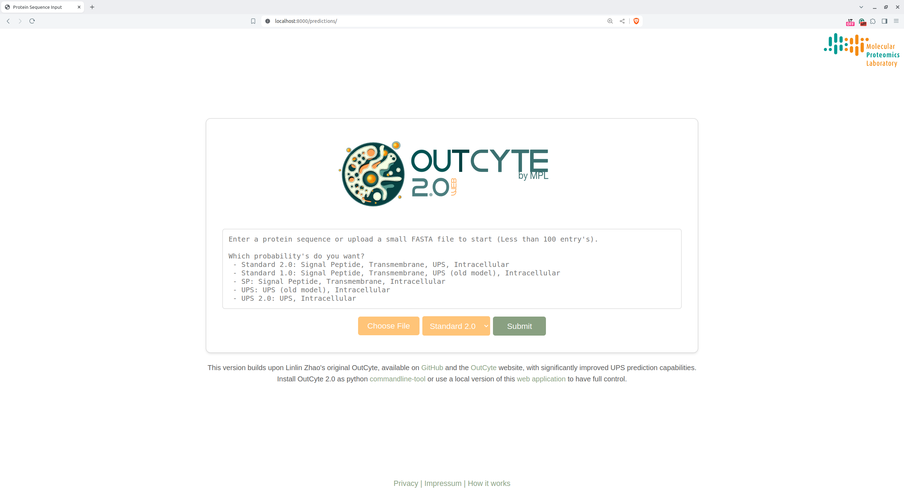

## What is OutCyte 2.0-Web?
**OutCyte 2.0-Web** is an WebApplication version of [OutCyte 2.0](https://github.com/JaVanGri/OutCyte-2.0). A running server can be found [here](http://134.99.206.168). OutCyte 2.0 is an advanced tool designed for predicting various cellular localization attributes, including signal peptides, transmembrane regions, unconventional protein secretion (UPS), and intracellular proteins, based on the amino acid sequence of proteins. It is an enhancement over the previous tool developed by Linlin Zhao, which can be found at [Linlin Zhao's OutCyte](https://github.com/linlinzhao/outcyte). This version significantly improves the prediction accuracy for UPS proteins.

The web application's interface is designed for ease of use, providing a user-friendly and intuitive experience that simplifies complex predictive analyses, making it accessible to researchers of all levels.
## How to use it?

To effectively utilize OutCyte 2.0-Web, please follow these steps:

1. **Install the dependencies**:
   - Ensure you have Conda installed on your system.
   - All necessary dependencies are listed in `environment.yml.` Install them by running the following command in the terminal:
   ```
   conda env create -f environment.yml
   ```

2. **Activate the Conda environment**:
   ```
   conda activate oc2-server
   ```

3. **Prepare your FASTA file**:
   - Ensure your FASTA file is formatted correctly with the sequences you wish to analyze.
   
3.5 **For first run**:
   ```
   python main/manage.py makemigrations
   python main/manage.py makemigrate
   ```


4. **Run the application**:
   - You can simply start the server by running:
   ```
   python main/manage.py runserver 
   ```

5. **Settings**:
   - Adjust settings like the maximum allowed file size in the `main/oc_settings.py.`


